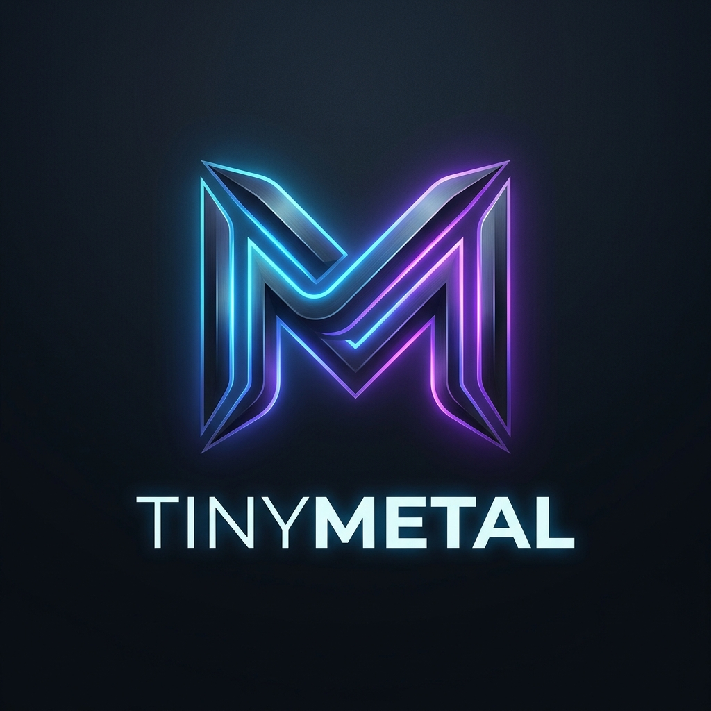

<p align="center">
  
</p>

<p align="center">
  <a href="https://github.com/YOUR_GITHUB_USERNAME/YOUR_REPO_NAME/stargazers">
    
  </a>
  <a href="https://github.com/YOUR_GITHUB_USERNAME/YOUR_REPO_NAME">
    
  </a>
  <a href="https://github.com/YOUR_GITHUB_USERNAME/YOUR_REPO_NAME/network/members">
    
  </a>
</p>

# TinyMetal: Learning metal-cpp on Apple Silicon

A step-by-step tutorial repository for learning Apple's modern graphics API using **`metal-cpp`** (the official header-only C++ wrapper) on Apple Silicon Macs.

This repository demonstrates how to build a modular C++ graphics/rendering engine starting from a blank screen to drawing complex shapes and GPU pipelines, while avoiding standard C++ / Objective-C header conflicts.

---

## 🚀 Roadmap & Progress

- [x] **Native macOS Window** (Cocoa Integration)
- [x] **Live Render Loop** (MetalKit / `MTKViewDelegate`)
- [x] **Metal Device & Command Queue** (GPU Initialization)
- [x] **Swap Chain** (via `CAMetalLayer` / `MTKView`)
- [x] **Triangle Rendering** (Pipeline States & GPU Buffers)
- [x] **Multi-Shape Rendering** (France Flag Geometry & Colors)
- [ ] Vertex Indexing (`MTL::Buffer` indices)
- [ ] Textures & Samplers
- [ ] Camera System & Uniform Buffers
- [ ] Mesh Loading (OBJ Loader)
- [ ] Lighting (Phong / Blinn-Phong)
- [ ] Compute Shaders (GPU Physics)
- [ ] GPU Particle Systems
- [ ] Deferred Rendering
- [ ] Physically Based Rendering (PBR)
- [ ] Raytracing (Hardware-accelerated)

---

## 🏗 Decoupled Architecture

One of the biggest hurdles when writing C++ Metal code is the symbol naming collision between Apple's native Objective-C headers (`<Metal/Metal.h>`) and C++ headers (`<Metal/Metal.hpp>`). Including both in the same file causes compiler errors due to redeclarations of system constants (e.g. `MTLCommonCounterSetTimestamp`).

This repository implements a **decoupled architecture** to solve this:
*   **`main.mm` (Objective-C++):** Handles platform-specific actions (native Cocoa windowing, MTKView initialization, and OS events). It only imports native framework headers and bridges pointers using `(__bridge void*)`.
*   **`Renderer.hpp` (Pure C++ Header):** Declares the C++ engine logic. It uses C++ forward declarations to avoid leaking `metal-cpp` headers into the Objective-C++ window wrapper.
*   **`Renderer.cpp` (Pure C++):** Imports `metal-cpp` headers, compiles the MSL shaders, allocates GPU buffers, and encodes draw commands.

---

## 📁 Repository Structure

```text
├── README.md                 # Project Overview & Roadmap
├── getting_started.md        # Memory Management & baseline template guide
├── tuto1.md                  # Tutorial: Native Window & Render Loop
├── tuto2.md                  # Tutorial: Creating the GPU Pipeline (Triangle)
├── tuto3.md                  # Tutorial: France Flag (Quads & Multi-Shape Drawing)
└── TinyEngine/
    ├── CMakeLists.txt        # Root build configuration
    ├── cmake/                # Helper CMake modules
    ├── external/
    │   └── metal-cpp/        # Submodule: Apple's official C++ wrapper for Metal
    ├── engine/               # Future folder for shared engine components
    ├── sandbox/
    │   ├── main.mm           # Native Window entry point (AppKit & MetalKit)
    │   ├── Renderer.hpp      # C++ forward declarations
    │   └── Renderer.cpp      # C++ engine logic (GPU configuration & Draw calls)
    └── shaders/
        └── shaders.metal     # Metal Shading Language (MSL) source
```

---

## 🛠 Prerequisites

To build and run this repository, you need:
*   An **Apple Silicon Mac** (M1, M2, M3, M4) running macOS
*   **Xcode Command Line Tools** (install via `xcode-select --install`)
*   **CMake 3.20** or newer

---

## 📦 Build & Launch Instructions

Clone the repository with submodules (to pull the `metal-cpp` source):
```bash
git clone --recursive <your-repo-url>
cd TinyMetal
```

### 1. Configure the Build System
Run CMake from the project root. This configures the target and generates the header-lookup database (`compile_commands.json`):
```bash
cmake -B TinyEngine/build -S TinyEngine
```

### 2. Build
Compile the Sandbox executable:
```bash
cmake --build TinyEngine/build
```

### 3. Run
Launch the application:
```bash
./TinyEngine/build/sandbox/Sandbox
```

---

## 💻 IDE Setup (VS Code, Clangd, or CLion)

To enable IntelliSense and auto-completion for `metal-cpp` headers (preventing `"Foundation/Foundation.hpp" not found` errors):

The build step generates `compile_commands.json` inside the `TinyEngine/build/` directory. Symlinks are automatically set up in the workspace root so that your IDE finds the header paths out of the box. 

If using the **Microsoft C/C++ Extension**, it will auto-read the `.vscode/settings.json` file in this repository:
```json
{
    "C_Cpp.default.compileCommands": "${workspaceFolder}/compile_commands.json"
}
```

---

## 📚 Credits & Reference

*   [Apple's metal-cpp release page](https://developer.apple.com/metal/cpp/)
*   [Metal Shading Language (MSL) Specification](https://developer.apple.com/metal/Metal-Shading-Language-Specification.pdf)